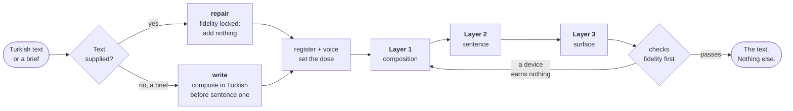
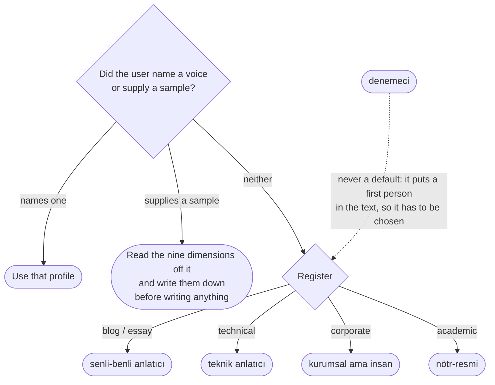

<h1 align="center">
  <picture>
    <source media="(prefers-color-scheme: dark)" srcset="brand/logo-dark.png">
    
  </picture>
</h1>

<p align="center">
  <strong>A Turkish humanizer skill for Claude.</strong><br>
  Writes and repairs Turkish that reads as if a person wrote it.
</p>

<p align="center">
  <a href="README.tr.md"></a>
  
  
</p>

<p align="center">
  <a href="#install">Install</a> ·
  <a href="#how-it-works">How it works</a> ·
  <a href="#what-actually-changes">Before / after</a> ·
  <a href="#registers-one-claim-three-doses">Registers</a> ·
  <a href="#voices-who-is-speaking">Voices</a> ·
  <a href="#evidence">Evidence</a> ·
  <a href="#faq">FAQ</a>
</p>

---

**turkish-humanify** is a Claude skill and Claude Code plugin that turns
AI-sounding Turkish into Turkish a person would have written. Most humanizer
tools swap words. This one rebuilds the sentence architecture underneath them,
because the words were never the problem.

LLM Turkish is grammatical and empty. The vocabulary is Turkish; the structure is
English. Modifiers trail their heads instead of standing in front of them, `ve`
sits where a converb belongs, and every sentence lands in the same
eighteen-to-twenty-five-word band. Readers notice the flatness before they can
name it.

> **Machine Turkish** — Bu yaklaşımı denedik ancak beklediğimiz sonucu alamadık ve bir süre sonra tamamen farklı bir yöntem üzerinde çalışmaya başladık. Ekip olarak bu kararın doğru olduğunu düşünüyoruz çünkü yeni yöntem hem daha hızlı hem de bakımı daha kolay bir çözüm sunuyor.

> **Human Turkish** — Bu yaklaşımı denedik. Olmadı. Bir süre sonra bambaşka bir yöntemin üzerine oturduk. Ekip olarak da doğru karar olduğunu düşünüyoruz, çünkü yenisi hem daha hızlı çalışıyor hem de bakımı bizi daha az yoruyor.

Both are correct Turkish. Only one of them was written by somebody.

---

## Install

**Claude Code plugin.** Both lines are needed: `@durmazoguzhan` names a
marketplace, and a marketplace has to be added before anything installs from it.

```
/plugin marketplace add durmazoguzhan/turkish-humanify
/plugin install turkish-humanify@durmazoguzhan
```

**Skills CLI** — `npx skills add durmazoguzhan/turkish-humanify --skill turkish-humanify`

**Manual** — `cp -r skills/turkish-humanify ~/.claude/skills/`

Then just ask, in Turkish or English. The skill triggers on its own description.

```
Şu blog yazısını insan eliyle yazılmış gibi yeniden yaz:
<metin>
```

Output is **the text and nothing else** — no preamble, no report, no word count.
Ask what changed and it will tell you; it never volunteers it.

---

## How it works

`skills/turkish-humanify/SKILL.md` is a thin router. Everything else lives in
seven reference files read at the moment they are used, because worked
before/after pairs are the instruction and a remembered summary of them is not.



Write mode makes its composition decisions in Turkish before the first sentence,
because a piece drafted in English shape and cleaned afterwards keeps its English
skeleton.

---

## What actually changes

### Layer 2 · sentence architecture

Where most of the work happens. Two of the fourteen — branching direction and the
converb system — account for most of what makes machine Turkish feel
machine-made, because both are about how clauses attach to each other, which is
where English structure survives translation most stubbornly.

| Divergence | Machine Turkish | Human Turkish |
|---|---|---|
| **Branching** — Turkish stands modifiers in front of the head, not behind it | Bir sistem kurduk, bu sistem her gece verileri tarayıp raporluyor. | **Her gece verileri tarayıp raporlayan** bir sistem kurduk. |
| **Converb** (`ulaç`) — `ve` between two predicates is usually a missed suffix | Veriyi çektik **ve** sonra işledik. | Veriyi çek**ip** işledik. |
| | Cache doldu **ve** istekler yavaşladı. | Cache dol**unca** istekler yavaşladı. |
| | Trafik arttı **ve** buna bağlı olarak hatalar da arttı. | Trafik art**tıkça** hatalar da arttı. |
| **Evidentiality** (`-mIş`) — Turkish marks whether you witnessed it | Sunucu gece yeniden başladı. *(read off a log)* | Sunucu gece yeniden başla**mış**. |
| | Bütün gece çalıştılar. *(found out next morning)* | **Meğer** bütün gece çalış**mışlar**. |
| **`-DIr` inflation** — Turkish has no present-tense copula | Bu yöntem etkili**dir**. | Bu yöntem etkili. |
| | Bu, sistemin en kritik parçası**dır**. | Burası sistemin en kritik parçası. |
| **Aorist vs `-yor`** — habitual and current are different tenses | Redis veriyi bellekte tut**uyor**. | Redis veriyi bellekte tut**ar**. |
| **Inversion** (`devrik cümle`) — blog register only, two or three per piece | Kimse bu yazıları okumuyor. | Kimse okumuyor bu yazıları. |
| **Discourse particles** — `işte` `ise` `zaten` `hani` `yani` `bir de` | Bu yöntem işe yaramıyor. Başka bir yol denemeliyiz. | Bu yöntem işe yaramıyor **işte**. Başka bir yol denemek lazım. |
| | Birinci grup hızlı, ikinci grup yavaş. | Birinci grup hızlı, ikincisi **ise** yavaş. |
| **Pro-drop** — the person ending already carries the subject | **Ben** bunu yaptım, sonra **ben** şunu ekledim. | Bunu yaptım, sonra şunu ekledim. |
| **Noun-compound chains** — three linked nouns is the ceiling | müşteri segmentasyon modülü performans iyileştirme çalışması | müşteri segmentasyon modülü**nde yaptığımız** performans çalışması |
| **Relative `ki`** — a calque; Turkish uses a participle | Bir sistem kurduk **ki** bu sistem her gece çalışıyor. | Her gece çalışan bir sistem kurduk. |
| **Passive bleed** — academic convention leaking everywhere | Bu sorun tarafımızdan çözülmüştür. | Bu sorunu çözdük. |

**Focus position.** Turkish marks emphasis by position: the slot immediately
before the verb carries it. Same four words, three different sentences.

| Ben dün İzmir'e gittim. | İzmir'e dün **ben** gittim. | Ben İzmir'e **dün** gittim. |
|---|---|---|
| neutral | it was *I* who went | it was *yesterday* |

**Self-correction** (`öz-düzeltme`) is the device blind readers reward most: the
writer says something, then narrows it in the next breath. Machine Turkish never
does it, because it writes as though it already knew.

> **Machine** — Silme işlemi idempotenttir, bu yüzden tercih edilir.
>
> **Human** — Silme idempotent olduğu için tercih ediliyor. Daha doğrusu, güncellemek de çalışır; ama yanlış gittiğinde sessizce yanlış gider.

Every rule in the reference files carries the conditions under which it **stops**
applying. A rule without its limit becomes a new tic, and a text full of
inversions is no more human than a text with none.

### Layer 1 · composition

Machine Turkish announces its topic; Turkish writing starts the piece. An
announcement is a sentence *about* the article. A start *is* the article.

| | Machine Turkish | Human Turkish |
|---|---|---|
| **Opening** | Kapadokya, Türkiye'nin en çok ziyaret edilen bölgelerinden biridir ve pek çok tarihi yapıya ev sahipliği yapmaktadır. | *(sahne)* Sabahın dördünde kalkmak kulağa işkence gibi geliyor. Balonlar havalanırken vadiye bakınca geliyor mu, orası ayrı. |
| **Closing** | Sonuç olarak, tek başına seyahat etmenin bireye kattığı deneyimler yadsınamaz. | *(dönüş)* Tadı da güzel oluyor tabii. Ama asıl mesele o değil. |
| **Title** | Cache Invalidation Nedir? | Redis'te veriyi koymak kolay, çıkarmak zor |
| **Subheading** | `## Cache Stampede Problemi Ve Çözüm Yöntemleri` | `## Popüler bir key expire olduğu anda ne oluyor` |
| **Bold and emoji** | **Saniyeler içinde fatura kesin** — Müşterinizi seçin, kalemleri girin, gönderin. **e-Fatura** ve **e-Arşiv** entegrasyonu ile faturanız doğrudan **GİB'e** iletilir. ☕ | Müşteriyi seçin, kalemleri girin, gönderin. Fatura e-Fatura ve e-Arşiv entegrasyonuyla doğrudan GİB'e gidiyor. |

### Layer 3 · surface

**Technical terms are not force-translated.** This is the rule the whole skill is
built around. Forcing a translation does not make the text more Turkish, it makes
it wrong: a Turkish engineer reading "uç nokta" has to translate back into
English to understand it.

| Bucket | Terms | Emitted as |
|---|---|---|
| No Turkish word an engineer actually says | `endpoint` `event-driven` `deploy` `queue` `middleware` `idempotent` | kept verbatim — never *uç nokta*, *olay güdümlü*, *çekme isteği* |
| A real Turkish word exists and is used | developer, marketplace, validation, production | geliştirici, pazaryeri, doğrulama, canlı ortam |
| Both circulate | `cache` / önbellek · `server` / sunucu · `request` / istek | pick one per text and hold it |

**A kept term still inflects — from its pronunciation, not its spelling.** This is
the most common LLM error in Turkish technical writing.

| Written | cache | queue | SQL | JSON | Google |
|---|---|---|---|---|---|
| **Said** | keş | kü | es-kü-el | ceyson | gugıl |
| **Correct** | `cache'i` | `queue'yu` | `SQL'i` | `JSON'ı` | `Google'ın` |

Guessing harmony from the spelling produces `cache'ı`, `queue'yü`, `SQL'ı` — all
wrong, all common.

| Punctuation and idiom | Machine Turkish | Human Turkish |
|---|---|---|
| The em dash belongs to dialogue in Turkish, not to asides | Kurulum sihirbazı projelerinizi aktarır **—** böylece ilk günden başlarsınız. | Kurulum sihirbazı projelerinizi aktarır**;** böylece ilk günden başlarsınız. |
| There is no en dash in Turkish; TDK gives ranges to the hyphen | `04.30–05.00` arası, `Nisan–haziran` en iyi dönem. | `04.30-05.00` arası, `Nisan-haziran` en iyi dönem. |
| Calqued idiom | Cache stratejisi performans açısından **kritik öneme sahiptir**. | Cache stratejisi performansı doğrudan belirliyor. |

### And how the whole thing fails

Applied by quota, the layer produces its own tells — and blind judges diagnosed
every one of these in output these very rules had generated.

| Over-applied | Better |
|---|---|
| Hata yok. Uyarı yok. Her şey yeşil. | Ne hata vardı ne uyarı; her şey yolunda görünüyordu. |
| Config sorunu değildi. Kod hatası değildi. Deploy eskiydi. | Ne config sorunuydu ne de kod hatası; deploy eskiydi. |
| Peki hangisi doğru? Ekibinize bağlı. | Doğru cevap ekibinizin geçmişten ne beklediğine bağlı. |

The measured instance: on one blog post the skill ended four sentences with
`ama`. The source carried **zero**. A device the source never used, appearing
four times in four hundred words, is not voice — it is a quota being met. So
every device is delete-tested before the text is emitted: remove it, and if
nothing is lost, it was decoration.

---

## Registers: one claim, three doses

Four registers decide **how hard each layer presses**, not whether the skill is
right. A rule applied outside its register does damage: an inverted sentence in a
contract reads as carelessness, a `-mIş` in a methods section is a lie about who
witnessed what, and stripping `-DIr` out of a specification makes the
specification wrong.

| Layer | blog / essay | technical | corporate | academic / official |
|---|---|---|---|---|
| **composition** | full | medium | medium | off |
| **sentence** | full — inversion, particles and `-mIş` in play | no inversion, few particles | no list-to-prose conversion | branching, converbs and focus only; `-mAktAdIr` stays |
| **surface** | full | full | full | full |

Surface is always on: orthography and terminology are correctness, not style.

The same claim at three doses. What changes is how much of the writer is audible,
never the content.

| | |
|---|---|
| *input, unaided* | Cache stratejisinin doğru belirlenmesi, sistem performansı açısından kritik öneme sahiptir. |
| **academic** | Cache stratejisinin doğru belirlenmesi, sistem performansı açısından belirleyicidir. |
| **technical** | Cache stratejisini doğru belirlemek performansı doğrudan belirler. |
| **blog** | Performansı belirleyen şey cache stratejisi işte. |

---

## Voices: who is speaking

A voice here is not "samimi" or "akıcı" — those words carry no instruction. It is
a position on **nine observable dimensions**: address, sentence length and
variance, clause linkage, tense-mood distribution, particle density, terminology
preference, inversion rate, paragraph length, concreteness.



| Voice | Who is speaking | A line of it |
|---|---|---|
| `senli-benli anlatıcı` | someone who just got back and is telling you across a table | Güzeldi orası, gerçekten. |
| `teknik anlatıcı` | the colleague who debugged this at 2am and is saving you the same night | Blog yazısı beş dakika eski kalabilir. Stok adedi kalamaz. |
| `denemeci` | someone working out what they think while writing, and letting you watch | Meğer ölçmediğim her değişken her sabah kendi kafasına göre davranıyormuş. |
| `kurumsal ama insan` | the founder answering a customer's email personally | Sözleşme yok, istediğiniz an iptal edersiniz. |
| `nötr-resmi` | nobody, deliberately — but a nobody edited by someone competent | Ampirik alanyazın tek yönlü bir tablo sunmamaktadır. |

**Voice comes from stance toward material that is already there, never from new
material.** Ordering, emphasis, hedging, admitting difficulty and self-correction
are always available. A first-person experience the source does not report is
not, and that boundary exists because of a measured failure — see below.

---

## What it will not do

1. **Force-translate a technical term.** `endpoint` stays `endpoint`.
2. **Emit an em dash, an emoji, or chat residue.** No "Elbette!", no word count.
3. **Add anything, in repair mode.** No number, name, date, claim or causal link
   that is not in the source. A converb is a claim too: two source sentences that
   merely sit next to each other are allowed to sit next to each other.
4. **Evade AI detectors.** The target is quality, not classifiers. It is also not
   a Turkish purism tool, and it does not judge whether your argument is any good.

---

## Evidence

Everything above is checkable here. `evals/` holds twenty-six baseline texts of
unaided model Turkish from clean-context subagents, plus published Turkish for
calibration — including five journal articles from 2015 to 2019, early enough
that none of them can be model output.

| Measurement | Result |
|---|---|
| **Repair mode**, blind pairwise against a competing skill | **16–5** across 21 files, sign test p = 0.027, the other arm held byte-identical |
| **Write mode**, with the skill against without | **11–1**, p = 0.0032 — up from 7–5, p = 0.387, before the mode split |
| Unaided model Turkish, blind ranking | never first in twelve; last nine times |
| Fidelity findings in this skill's own output | clean across 21 texts for six rounds, then four in round seven and one in round eight |
| Document structure preserved | ten of eleven generations — every row of a 25-row API reference, every bullet of a runbook |
| Counting bugs found in the measuring instrument | **ten**, each of which had already produced a confident wrong finding |

Sources: `evals/RESULTS.md`, `evals/RESULTS-write.md`, `evals/rubric.md`,
`skills/turkish-humanify/references/rewrite-mode.md`.

Read the round-seven number carefully: the check itself widened between rounds
six and seven. Earlier rounds looked for material *absent* from the source; round
seven also looked for source material *strengthened* — a hedge dropped, a
superlative added. Two of the four would have been caught by the older check and
two would not. Partly a worse text, partly a sharper instrument, and written up
rather than smoothed over. One file, `blog-1`, has lost five times to the same
three invented sentences; it is not winnable without fabricating, so it stays
lost.

### The warning this evaluation produced

**A blind "which reads more human" test rewards fabrication**, because inventing
the writer's experience is the fastest way to sound like a writer. One judge
ranked a text first and named three sentences as proof a person wrote it. None of
the three was in the source.

The judge was not wrong that those sentences read as human. That is the problem.
Any measurement of a humanizer that stops at human-likeness is measuring
something that can be won by lying — which is why fidelity was pre-registered
here as outranking the score, in writing, before any results were in.
`evals/repair-protocol.md` fixes the generation wrapper, the judge prompt, the
randomisation and the fidelity check so that rounds are comparable to each other.

---

## FAQ

**What is a Turkish humanizer?** A tool that rewrites AI-generated Turkish so it
reads as human-written. Most work on vocabulary and punctuation. turkish-humanify
works on sentence architecture — branching direction, the converb system, focus
position, evidentiality — because that is where English structure actually
survives translation into Turkish.

**Does it work with models other than Claude?** The routing in `SKILL.md` is
written for Claude's skill system, but the seven reference files are plain
Markdown holding rules and worked pairs. They port to anything that can read
instructions from a file.

**Will it translate my technical terms into Turkish?** No — that is invariant one.
Where a Turkish word genuinely exists and Turkish engineers actually say it, that
word is used; otherwise the English term stays and inflects from its
pronunciation.

**Can it invent details to sound more human?** No. In repair mode fidelity
outranks everything, and the project's own findings against that rule are
published rather than hidden.

**Is this for bypassing AI detectors?** No. The target is quality, and the skill
is not tested against classifiers.

**Does it work on Turkish a human wrote?** Yes, as an editor. It is most useful on
text that is grammatical but flat.

---

## Adapting this to another language

The layer split is the reusable part, and it is why the prose here is English
while every example is Turkish. Ask, for your language: where does it branch, and
does the model get that backwards? How does it mark emphasis, and does the model
mark it the English way? Does it grammaticalise something English lacks? What
does it fuse that English joins with a conjunction? Those questions produce your
layer 2. Layer 1 is largely language-independent; layer 3 is entirely local.

Two things are worth copying whatever the language. **Build the measuring
instrument before the corpus** and calibrate it against published writing in that
language — here that caught ten separate bugs, each of which had already produced
a confident wrong finding. And **decide in advance what beats what, in writing**,
before you see any results.

---

## Project

- **Contributing** — `CONTRIBUTING.md`. Rules are measured before they are added,
  `evals/repair-protocol.md` is the procedure, and fidelity outranks the score.
  Reporting a bad Turkish sentence in an issue is a genuinely useful contribution
  and costs you nothing.
- **Releases** — every merge to `master` is one. CI tags `v<version>` and
  publishes generated notes, so no release step is done by hand.
- **Versioning** — [WendtVer](https://wendtver.org): the version is the commit
  count, written one digit at a time. A skill has no contract to break, so SemVer
  would encode a severity judgement that does not exist.
- **Brand** — `brand/` holds the logo and `brand/guidelines.md`. The mark draws
  the converb: two arms arrive, one body leaves, and the conjunction English
  would have needed is the width that went missing.
- **Policies** — `SECURITY.md`, `CODE_OF_CONDUCT.md`. **Licence** — MIT, `brand/`
  included.
