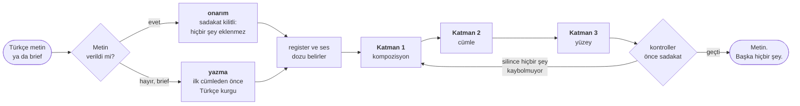
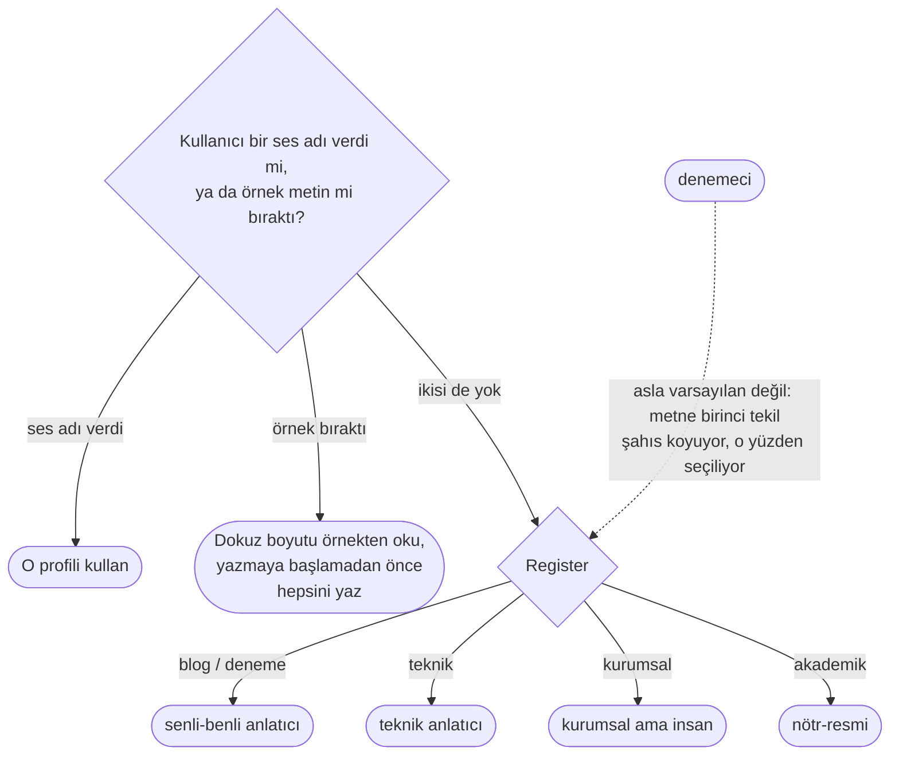

<h1 align="center">
  <picture>
    <source media="(prefers-color-scheme: dark)" srcset="brand/logo-dark.png">
    
  </picture>
</h1>

<p align="center">
  <strong>Claude için Türkçe humanizer skill'i.</strong><br>
  İnsan eliyle yazılmış gibi okunan Türkçe yazar, yazılmışı onarır.
</p>

<p align="center">
  <a href="README.md"></a>
  
  
</p>

<p align="center">
  <a href="#kurulum">Kurulum</a> ·
  <a href="#nasıl-çalışıyor">Nasıl çalışıyor</a> ·
  <a href="#ne-değişiyor">Öncesi / sonrası</a> ·
  <a href="#registerlar-aynı-iddia-üç-doz">Register'lar</a> ·
  <a href="#sesler-kim-konuşuyor">Sesler</a> ·
  <a href="#kanıt">Kanıt</a> ·
  <a href="#sık-sorulanlar">Sık sorulanlar</a>
</p>

---

**turkish-humanify**, yapay zekanın yazdığı Türkçeyi insanın yazacağı Türkçeye
çeviren bir Claude skill'i ve Claude Code plugin'i. Piyasadaki humanizer
araçlarının çoğu kelime değiştirir; bu, kelimelerin altındaki cümle mimarisini
yeniden kurar. Sorun hiçbir zaman kelimeler değildi.

LLM Türkçesi dilbilgisi açısından kusursuz, ama içi boş. Kelimeler Türkçe, yapı
İngilizce: niteleyiciler başın önünde duracakken arkasına takılıyor, ulaç
gerektiren yere `ve` giriyor, her cümle aynı 18-25 kelimelik banda oturuyor.
Okur bu düzlüğü, adını koyamadan fark eder.

> **Makine Türkçesi:** Bu yaklaşımı denedik ancak beklediğimiz sonucu alamadık ve bir süre sonra tamamen farklı bir yöntem üzerinde çalışmaya başladık. Ekip olarak bu kararın doğru olduğunu düşünüyoruz çünkü yeni yöntem hem daha hızlı hem de bakımı daha kolay bir çözüm sunuyor.

> **İnsan Türkçesi:** Bu yaklaşımı denedik. Olmadı. Bir süre sonra bambaşka bir yöntemin üzerine oturduk. Ekip olarak da doğru karar olduğunu düşünüyoruz, çünkü yenisi hem daha hızlı çalışıyor hem de bakımı bizi daha az yoruyor.

İkisi de doğru Türkçe. Ama birini biri yazmış.

---

## Kurulum

**Claude Code plugin.** İki satır da gerekiyor: `@durmazoguzhan` bir marketplace
adı, marketplace eklenmeden içinden bir şey kurulamıyor.

```
/plugin marketplace add durmazoguzhan/turkish-humanify
/plugin install turkish-humanify@durmazoguzhan
```

**Skills CLI:** `npx skills add durmazoguzhan/turkish-humanify --skill turkish-humanify`

**Elle:** `cp -r skills/turkish-humanify ~/.claude/skills/`

Sonrası düz istek. Skill kendi açıklamasıyla tetikleniyor, ayrıca çağırman
gerekmiyor.

```
Şu blog yazısını insan eliyle yazılmış gibi yeniden yaz:
<metin>
```

Çıktı **metnin kendisi, başka hiçbir şey**: ne giriş cümlesi, ne rapor, ne
kelime sayısı. Ne değiştiğini sorarsan anlatır; sormadan anlatmaz.

---

## Nasıl çalışıyor

`skills/turkish-humanify/SKILL.md` ince bir yönlendirici. Geri kalan her şey,
kullanılacağı anda okunan yedi referans dosyasında duruyor; çünkü asıl talimat
işlenmiş öncesi/sonrası çiftleri, onların hatırlanan özeti değil.



Yazma modu kompozisyon kararlarını ilk cümleden önce Türkçe veriyor. İngilizce
kurulup sonra temizlenen bir metin İngilizce iskeletini koruyor, okurun hissettiği
şey de o iskelet.

---

## Ne değişiyor

### Katman 2 · cümle mimarisi

İşin çoğu burada dönüyor. On dört maddeden ikisi, dallanma yönü ile ulaç
sistemi, makine Türkçesini makine yapan şeyin büyük kısmını tek başına
açıklıyor: ikisi de cümleciklerin birbirine nasıl bağlandığıyla ilgili ve
İngilizce yapı en inatla o düzeyde hayatta kalıyor.

| Ayrım | Makine Türkçesi | İnsan Türkçesi |
|---|---|---|
| **Dallanma:** Türkçe niteleyiciyi başın arkasına değil önüne koyar | Bir sistem kurduk, bu sistem her gece verileri tarayıp raporluyor. | **Her gece verileri tarayıp raporlayan** bir sistem kurduk. |
| **Ulaç:** iki yüklem arasındaki `ve` çoğu zaman kaçırılmış bir ek | Veriyi çektik **ve** sonra işledik. | Veriyi çek**ip** işledik. |
| | Cache doldu **ve** istekler yavaşladı. | Cache dol**unca** istekler yavaşladı. |
| | Trafik arttı **ve** buna bağlı olarak hatalar da arttı. | Trafik art**tıkça** hatalar da arttı. |
| **Delil kipi** (`-mIş`): Türkçe, olayı görüp görmediğini dilbilgisiyle işaretler | Sunucu gece yeniden başladı. *(log'dan okuyorsun)* | Sunucu gece yeniden başla**mış**. |
| | Bütün gece çalıştılar. *(ertesi sabah öğrendin)* | **Meğer** bütün gece çalış**mışlar**. |
| **`-DIr` şişmesi:** Türkçede geniş zaman koşacı yok | Bu yöntem etkili**dir**. | Bu yöntem etkili. |
| | Bu, sistemin en kritik parçası**dır**. | Burası sistemin en kritik parçası. |
| **Geniş zaman / `-yor`:** alışkanlık ile o an olan aynı kip değil | Redis veriyi bellekte tut**uyor**. | Redis veriyi bellekte tut**ar**. |
| **Devrik cümle:** sadece blog register'ında, bir yazıda iki üç tane | Kimse bu yazıları okumuyor. | Kimse okumuyor bu yazıları. |
| **Söylem parçacıkları:** `işte` `ise` `zaten` `hani` `yani` `bir de` | Bu yöntem işe yaramıyor. Başka bir yol denemeliyiz. | Bu yöntem işe yaramıyor **işte**. Başka bir yol denemek lazım. |
| | Birinci grup hızlı, ikinci grup yavaş. | Birinci grup hızlı, ikincisi **ise** yavaş. |
| **Özne düşürme:** şahıs eki özneyi zaten taşıyor | **Ben** bunu yaptım, sonra **ben** şunu ekledim. | Bunu yaptım, sonra şunu ekledim. |
| **Ad tamlaması zinciri:** pratikte tavan üç ad | müşteri segmentasyon modülü performans iyileştirme çalışması | müşteri segmentasyon modülü**nde yaptığımız** performans çalışması |
| **İlgi `ki`'si:** calque; Türkçe bunu sıfat-fiille kurar | Bir sistem kurduk **ki** bu sistem her gece çalışıyor. | Her gece çalışan bir sistem kurduk. |
| **Edilgen taşması:** akademik konvansiyon her register'a sızıyor | Bu sorun tarafımızdan çözülmüştür. | Bu sorunu çözdük. |

**Vurgu yeri.** Türkçe vurguyu konumla işaretler: yüklemin hemen önündeki yuva
onu taşır. Aynı dört kelime, üç ayrı cümle.

| Ben dün İzmir'e gittim. | İzmir'e dün **ben** gittim. | Ben İzmir'e **dün** gittim. |
|---|---|---|
| nötr | giden *bendim* | *dün* gittim |

**Öz-düzeltme**, kör okurların en tutarlı ödüllendirdiği araç: yazan bir şey
söylüyor, hemen ardından onu daraltıyor. Makine Türkçesi bunu hiç yapmıyor,
çünkü zaten biliyormuş gibi yazıyor.

> **Makine:** Silme işlemi idempotenttir, bu yüzden tercih edilir.
>
> **İnsan:** Silme idempotent olduğu için tercih ediliyor. Daha doğrusu, güncellemek de çalışır; ama yanlış gittiğinde sessizce yanlış gider.

Referans dosyalarındaki her kural, **nerede durduğunu** da yazıyor. Sınırı
olmayan bir kural yeni bir tike dönüşüyor; devrik cümleyle dolu bir metin, hiç
devriği olmayandan daha insan değil.

### Katman 1 · kompozisyon

Makine Türkçesi konusunu ilan eder, Türkçe yazı yazıya başlar. İlan, yazı
*hakkında* bir cümle. Başlangıç ise yazının kendisi.

| | Makine Türkçesi | İnsan Türkçesi |
|---|---|---|
| **Açılış** | Kapadokya, Türkiye'nin en çok ziyaret edilen bölgelerinden biridir ve pek çok tarihi yapıya ev sahipliği yapmaktadır. | *(sahne)* Sabahın dördünde kalkmak kulağa işkence gibi geliyor. Balonlar havalanırken vadiye bakınca geliyor mu, orası ayrı. |
| **Kapanış** | Sonuç olarak, tek başına seyahat etmenin bireye kattığı deneyimler yadsınamaz. | *(dönüş)* Tadı da güzel oluyor tabii. Ama asıl mesele o değil. |
| **Başlık** | Cache Invalidation Nedir? | Redis'te veriyi koymak kolay, çıkarmak zor |
| **Ara başlık** | `## Cache Stampede Problemi Ve Çözüm Yöntemleri` | `## Popüler bir key expire olduğu anda ne oluyor` |
| **Bold ve emoji** | **Saniyeler içinde fatura kesin** — Müşterinizi seçin, kalemleri girin, gönderin. **e-Fatura** ve **e-Arşiv** entegrasyonu ile faturanız doğrudan **GİB'e** iletilir. ☕ | Müşteriyi seçin, kalemleri girin, gönderin. Fatura e-Fatura ve e-Arşiv entegrasyonuyla doğrudan GİB'e gidiyor. |

### Katman 3 · yüzey

**Teknik terimler zorla çevrilmiyor.** Skill'in etrafında kurulduğu kural bu.
Zorlama çeviri metni Türkçeleştirmiyor, yanlışlıyor: "uç nokta" okuyan bir
Türk mühendis anlamak için cümleyi İngilizceye geri çeviriyor.

| Grup | Terimler | Nasıl çıkıyor |
|---|---|---|
| Mühendisin ağzına almadığı bir Türkçe karşılık | `endpoint` `event-driven` `deploy` `queue` `middleware` `idempotent` | olduğu gibi kalıyor; asla *uç nokta*, *olay güdümlü*, *çekme isteği* |
| Gerçekten kullanılan bir Türkçe karşılık var | developer, marketplace, validation, production | geliştirici, pazaryeri, doğrulama, canlı ortam |
| İkisi de dolaşımda | `cache` / önbellek · `server` / sunucu · `request` / istek | metin başına birini seç, sonuna kadar onu kullan |

**Kalan İngilizce terim de çekim alıyor, üstelik yazılışından değil
okunuşundan.** Türkçe teknik yazıda en sık görülen LLM hatası bu.

| Yazılışı | cache | queue | SQL | JSON | Google |
|---|---|---|---|---|---|
| **Okunuşu** | keş | kü | es-kü-el | ceyson | gugıl |
| **Doğrusu** | `cache'i` | `queue'yu` | `SQL'i` | `JSON'ı` | `Google'ın` |

Uyumu yazılıştan tahmin etmek `cache'ı`, `queue'yü`, `SQL'ı` üretiyor; üçü de
yanlış, üçü de yaygın.

| Noktalama ve deyim | Makine Türkçesi | İnsan Türkçesi |
|---|---|---|
| Uzun çizgi Türkçede diyalog işareti, ara söz işareti değil | Kurulum sihirbazı projelerinizi aktarır **—** böylece ilk günden başlarsınız. | Kurulum sihirbazı projelerinizi aktarır**;** böylece ilk günden başlarsınız. |
| Türkçede en dash diye bir işaret yok; TDK aralığı kısa çizgiye veriyor | `04.30–05.00` arası, `Nisan–haziran` en iyi dönem. | `04.30-05.00` arası, `Nisan-haziran` en iyi dönem. |
| Calque deyim | Cache stratejisi performans açısından **kritik öneme sahiptir**. | Cache stratejisi performansı doğrudan belirliyor. |

### Peki bu katman nasıl bozuluyor

Kotayla uygulandığında katmanın kendi tikleri çıkıyor ortaya. Aşağıdakilerin
hepsini, kör hakemler tam da bu kuralların ürettiği çıktıda teşhis etti.

| Aşırı | İyi |
|---|---|
| Hata yok. Uyarı yok. Her şey yeşil. | Ne hata vardı ne uyarı; her şey yolunda görünüyordu. |
| Config sorunu değildi. Kod hatası değildi. Deploy eskiydi. | Ne config sorunuydu ne de kod hatası; deploy eskiydi. |
| Peki hangisi doğru? Ekibinize bağlı. | Doğru cevap ekibinizin geçmişten ne beklediğine bağlı. |

Ölçülmüş örnek: bir blog yazısında skill dört cümleyi `ama` ile bitirdi.
Kaynakta bu kalıp **sıfır** kez geçiyordu. Kaynağın hiç kullanmadığı bir aracın
dört yüz kelimede dört kez çıkması ses değil, doldurulmuş bir kota. Bu yüzden
her araç metin çıkmadan önce silme testinden geçiyor: kaldır, hiçbir şey
kaybolmuyorsa süstü, gider.

---

## Register'lar: aynı iddia, üç doz

Dört register, skill'in doğru olup olmadığını değil, **her katmanın ne kadar
bastıracağını** belirliyor. Register'ının dışında uygulanan kural zarar veriyor:
sözleşmedeki devrik cümle özensizlik gibi okunuyor, yöntem bölümündeki bir
`-mIş` neyi kimin gördüğü konusunda yalan söylüyor, `-DIr`'i şartnameden
söküp almak şartnameyi yanlışlıyor.

| Katman | blog / deneme | teknik | kurumsal | akademik / resmi |
|---|---|---|---|---|
| **kompozisyon** | tam | orta | orta | kapalı |
| **cümle** | tam; devrik, parçacık ve `-mIş` serbest | devrik yok, parçacık az | listeyi düzyazıya çevirme yok | sadece dallanma, ulaç ve vurgu; `-mAktAdIr` kalır |
| **yüzey** | tam | tam | tam | tam |

Yüzey her zaman açık: yazım ve terminoloji üslup değil, doğruluk meselesi.

Aynı iddia, üç dozda. Değişen şey yazanın ne kadar duyulduğu; içerik değil.

| | |
|---|---|
| *ham girdi* | Cache stratejisinin doğru belirlenmesi, sistem performansı açısından kritik öneme sahiptir. |
| **akademik** | Cache stratejisinin doğru belirlenmesi, sistem performansı açısından belirleyicidir. |
| **teknik** | Cache stratejisini doğru belirlemek performansı doğrudan belirler. |
| **blog** | Performansı belirleyen şey cache stratejisi işte. |

---

## Sesler: kim konuşuyor

Buradaki ses "samimi" ya da "akıcı" değil; o kelimeler hiçbir talimat taşımıyor.
Ses, **gözlenebilir dokuz boyuttaki** bir konum: hitap, cümle uzunluğu ve
salınımı, cümlecik bağlama biçimi, kip dağılımı, parçacık yoğunluğu, terim
tercihi, devriklik oranı, paragraf uzunluğu, somutluk.



| Ses | Kim konuşuyor | Bir cümlesi |
|---|---|---|
| `senli-benli anlatıcı` | daha yeni dönmüş, masanın karşısından anlatıyor | Güzeldi orası, gerçekten. |
| `teknik anlatıcı` | bunu geçen ay gecenin ikisinde debug etmiş, aynı geceyi sana yaşatmıyor | Blog yazısı beş dakika eski kalabilir. Stok adedi kalamaz. |
| `denemeci` | ne düşündüğünü yazarken buluyor, seyretmene de izin veriyor | Meğer ölçmediğim her değişken her sabah kendi kafasına göre davranıyormuş. |
| `kurumsal ama insan` | müşterinin mailine bizzat cevap yazan kurucu | Sözleşme yok, istediğiniz an iptal edersiniz. |
| `nötr-resmi` | bilerek hiç kimse; ama işini bilen birinin editlediği bir hiç kimse | Ampirik alanyazın tek yönlü bir tablo sunmamaktadır. |

**Ses, zaten orada duran malzemeye karşı alınan tavırdan çıkıyor; yeni
malzemeden değil.** Sıralama, vurgu, çekince koyma, zorluğu itiraf etme ve
öz-düzeltme her zaman elinin altında. Kaynağın anlatmadığı birinci tekil bir
deneyim değil. Bu sınır, aşağıda anlatılan ölçülmüş bir hatadan çıktı.

---

## Yapmayacağı şeyler

1. **Teknik terimi zorla çevirmek.** `endpoint`, `endpoint` kalıyor.
2. **Uzun çizgi, emoji ya da sohbet artığı üretmek.** "Elbette!" yok, sonda
   kelime sayısı yok.
3. **Onarım modunda bir şey eklemek.** Kaynakta olmayan sayı, isim, tarih, iddia
   ya da nedensellik bağı girmiyor. Ulaç da bir iddia: kaynakta sadece yan yana
   duran iki cümlenin yan yana durmaya hakkı var.
4. **AI dedektörü atlatmak.** Hedef kalite, sınıflandırıcı değil. Bu bir Türkçe
   özleştirme aracı da değil, argümanının iyi olup olmadığına da karışmıyor.

---

## Kanıt

Yukarıdaki her iddia bu repoda kontrol edilebiliyor. `evals/` içinde temiz
bağlamlı subagent'lara yazdırılmış yirmi altı ham model Türkçesi metni, bir de
ölçüm aletini kalibre etmek için yayımlanmış Türkçe duruyor. Kalibrasyon
setinde 2015-2019 arasında yayımlanmış beş hakemli makale var; hiçbiri model
çıktısı olamayacak kadar erken.

| Ölçüm | Sonuç |
|---|---|
| **Onarım modu**, rakip bir skill'e karşı kör eşli karşılaştırma | 21 dosyada **16-5**, işaret testi p = 0,027, rakip kol byte düzeyinde sabit |
| **Yazma modu**, skill'li ve skill'siz | **11-1**, p = 0,0032; mod ayrımından önce 7-5 ve p = 0,387 idi |
| Ham model Türkçesi, kör sıralama | on iki turda hiç birinci olmadı, dokuz kez sonuncu |
| Skill'in kendi çıktısındaki sadakat bulguları | altı tur boyunca 21 metinde temiz, sonra yedinci turda dört, sekizinci turda bir |
| Belge iskeletinin korunması | on bir üretimin onunda; 25 satırlık bir API referansının her satırı, bir runbook'un her maddesi |
| Ölçüm aletinde bulunan sayma hatası | **on tane**; her biri kendinden emin bir yanlış bulgu üretmişti |

Kaynaklar: `evals/RESULTS.md`, `evals/RESULTS-write.md`, `evals/rubric.md`,
`skills/turkish-humanify/references/rewrite-mode.md`.

Yedinci turun sayısını dikkatli oku, çünkü altıncı ile yedinci tur arasında
kontrolün kendisi genişledi. Önceki turlar kaynakta *olmayan* malzemeyi
arıyordu; yedinci tur kaynaktaki malzemenin *güçlendirilmesine* de baktı, yani
düşen bir çekinceye, eklenen bir üstünlük derecesine. Dördün ikisi eski
kontrolden de kaçamazdı, ikisi kaçardı. Kısmen daha kötü bir metin, kısmen daha
keskin bir alet; ve üstü örtülmek yerine yazıya geçirildi. `blog-1` dosyası aynı
üç uydurma cümleye beş kez kaybetti; uydurmadan kazanılmıyor, o yüzden kayıp
kalıyor.

### Bu değerlendirmenin ürettiği asıl uyarı

**Kör "hangisi daha insan okunuyor" testi uydurmayı ödüllendiriyor**, çünkü
yazarın deneyimini uydurmak yazar gibi görünmenin en kısa yolu. Bir hakem bir
metni birinci sıraya koyup gerekçe olarak üç cümleyi gösterdi. Üçü de kaynakta
yoktu.

Hakem o cümlelerin insan gibi okunduğu konusunda yanılmıyordu. Asıl sorun da bu.
İnsan benzerliğinde duran bir humanizer ölçümü, yalan söyleyerek kazanılabilecek
bir şeyi ölçüyor. Sadakatin skorun önüne geçtiği bu yüzden, sonuçlar gelmeden
önce ve yazılı olarak kayda geçti. `evals/repair-protocol.md` üretim
sarmalayıcısını, hakem prompt'unu, rastgeleleştirmeyi ve sadakat kontrolünü
sabitliyor; turlar ancak böyle birbiriyle karşılaştırılabiliyor.

---

## Sık sorulanlar

**Türkçe humanizer nedir?** Yapay zekanın ürettiği Türkçeyi insan yazmış gibi
okunacak hale getiren araç. Çoğu kelime ve noktalama düzeyinde çalışıyor.
turkish-humanify cümle mimarisinde çalışıyor: dallanma yönü, ulaç sistemi, vurgu
yeri, delil kipi. İngilizce yapı çeviriden en çok o düzeyde sağ çıkıyor.

**Claude dışındaki modellerde çalışır mı?** `SKILL.md` içindeki yönlendirme
Claude'un skill sistemine göre yazıldı, ama yedi referans dosyası düz Markdown:
kurallar ve işlenmiş çiftler. Dosyadan talimat okuyabilen her sisteme taşınıyor.

**Teknik terimlerimi Türkçeye çevirir mi?** Hayır, birinci değişmez bu. Gerçekten
var olan ve Türk mühendislerin ağzına aldığı bir Türkçe karşılık varsa o
kullanılıyor; yoksa İngilizce terim kalıyor ve okunuşuna göre çekimleniyor.

**İnsan gibi dursun diye ayrıntı uydurur mu?** Hayır. Onarım modunda sadakat her
şeyin önünde ve projenin bu kurala karşı kendi bulguları saklanmak yerine
yayımlanıyor.

**AI dedektörlerini atlatmak için mi?** Değil. Hedef kalite; skill
sınıflandırıcılara karşı test edilmiyor.

**İnsanın yazdığı Türkçede işe yarar mı?** Yarar, editör gibi. En çok da
dilbilgisi doğru ama düz duran metinlerde.

---

## Başka bir dile uyarlamak

Yeniden kullanılabilir parça katman ayrımı; buradaki anlatım İngilizce, her örnek
Türkçe olmasının sebebi de o. Kendi dilin için sor: nereye dallanıyor, model bunu
ters mi kuruyor? Vurguyu neyle işaretliyor, model onu İngilizce yolla mı
işaretliyor? İngilizcede olmayan bir şeyi dilbilgisine mi yazmış? İngilizcenin
bağlaçla birleştirdiği neyi kaynaştırıyor? Bu sorular senin ikinci katmanını
üretiyor. Birinci katman büyük ölçüde dilden bağımsız, üçüncüsü tamamen yerel.

Dil ne olursa olsun kopyalanmaya değer iki şey var. **Ölçüm aletini korpustan
önce kur** ve o dilde yayımlanmış yazıyla kalibre et; burada bu kontrol on ayrı
hata yakaladı ve her biri çoktan kendinden emin bir yanlış bulgu üretmişti. Bir
de **neyin neyi yendiğine önceden, yazılı olarak karar ver**; sonuçları görmeden.

---

## Proje

- **Katkı:** `CONTRIBUTING.md`. Bu skill'e giren kural önce ölçülüyor,
  `evals/repair-protocol.md` prosedürü veriyor, sadakat skorun önünde geliyor.
  Kötü bir Türkçe cümleyi issue olarak bildirmek gerçekten işe yarayan bir katkı
  ve sana hiçbir şeye mal olmuyor.
- **Sürümler:** `master`'a giren her merge bir sürüm. CI `v<sürüm>` etiketini
  atıyor ve notları üretiyor, elle yapılan bir adım yok.
- **Sürüm numarası:** [WendtVer](https://wendtver.org): sürüm, rakam rakam
  yazılan commit sayısı. Bir skill'in kırılacak bir sözleşmesi olmadığı için
  SemVer var olmayan bir ciddiyet yargısını kodlamış olurdu.
- **Marka:** `brand/` logoyu ve `brand/guidelines.md` dosyasını taşıyor. İşaret
  ulacı çiziyor: iki kol giriyor, tek gövde çıkıyor, İngilizcenin ihtiyaç duyacağı
  bağlaç da eksilen genişlik oluyor.
- **Politikalar:** `SECURITY.md`, `CODE_OF_CONDUCT.md`. **Lisans:** MIT,
  `brand/` dahil.
